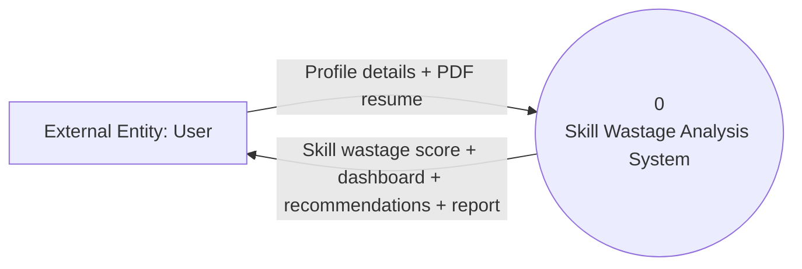
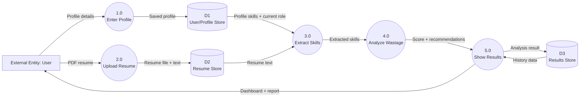

# DFD Diagrams - AI Skill Wastage Detection System

This DFD matches the current project flow:

```text
User Profile + Resume
->
Extract skills
->
Compare with current occupation requirements
->
Calculate Skill Wastage Score
->
Generate recommendations
->
Display dashboard, history, and report
```

## Is The Given DFD Correct?

The given DFD is partially correct, but it needs changes.

Correct parts:

- User uploads resume.
- System extracts skills.
- System matches skills.
- System generates score and recommendations.
- Results are stored and shown to the user.

Incorrect part:

- The diagram shows `D3 Job Skills Store`.
- Your project does not have a separate `job_skills` collection.
- Job/current-role skills are inferred during analysis from the user's profile/current role.

So the corrected data stores are:

```text
D1 User/Profile Store
D2 Resume Store
D3 Results Store
```

## DFD Level 0 - Context Diagram



## DFD Level 1 - Simple Version



## DFD Level 1 - Simple Explanation

```text
User enters profile details.
Profile is saved in User/Profile Store.
User uploads resume.
Resume text is saved in Resume Store.
System extracts skills from profile and resume.
System analyzes skill wastage.
System stores result in Results Store.
User views dashboard, history, recommendations, and report.
```

## Data Stores

```text
D1: User / Profile Store
    Collection: users
    Stores: name, email, firebase_uid
    Profile details are saved in frontend local storage in the current project.

D2: Resume Store
    Collection: resumes
    Stores: firebase_uid, file_name, extracted_text, text_length, created_at

D3: Results Store
    Collection: results
    Stores: resume_id, firebase_uid, skills, scores, recommendations, dashboard_report, created_at
```

## Correct Data Flow Explanation

1. User logs in or signs up.
2. User completes profile.
3. User uploads PDF resume.
4. Backend extracts resume text.
5. System extracts skills from profile and resume.
6. System infers current occupation skills from current role.
7. System compares possessed skills with current role skills.
8. System calculates Skill Wastage Score and Job Fit Score.
9. System stores result with `resume_id`.
10. Dashboard, history, recommendations, and report are shown to the user.
