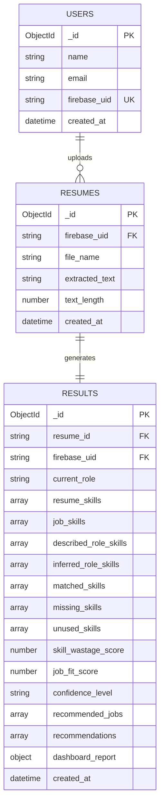

# ER Diagram - AI Skill Wastage Detection System

This ER diagram matches the strict relationship design requested for the project.

## Correct ER Diagram



## Relationship Explanation

```text
USERS 1 -> M RESUMES
RESUMES 1 -> 1 RESULTS
```

Explanation:

- One user can upload many resumes.
- Each resume belongs to one user using `firebase_uid`.
- Each uploaded resume generates one analysis result.
- Each result stores `resume_id` as a foreign key to the `resumes` collection.
- The result also stores `firebase_uid` for easy history lookup by user.

## Collections

Database name:

```text
skill_wastage
```

Collections:

```text
users
resumes
results
```

